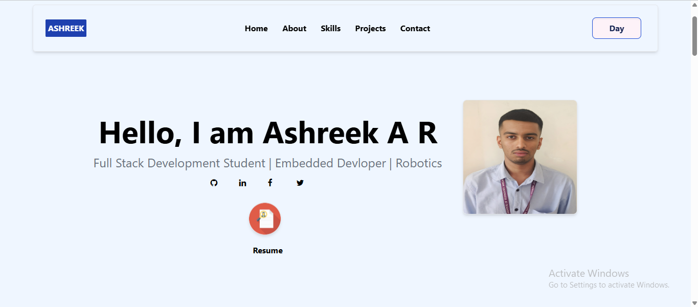

# Ashreek A R portfolio website template using tailwind css v4

Author: Ashreek A R

1) clone this repo
2) run "npm install" if you have tailwind CSS
3) can you tailwind css through CDN also but downloading it by following the tailwind css   documentation is recomended.

Follow this link to download tailwind CSS

https://tailwindcss.com/docs/installation/tailwind-cli

4) Now run "npm install" if using tailwind with CLI.
5) Run this command " npx @tailwindcss/cli -i ./src/input.css -o ./src/output.css --watch "
Make sure this is runnig while making any changes.
6) Now you are good to go.